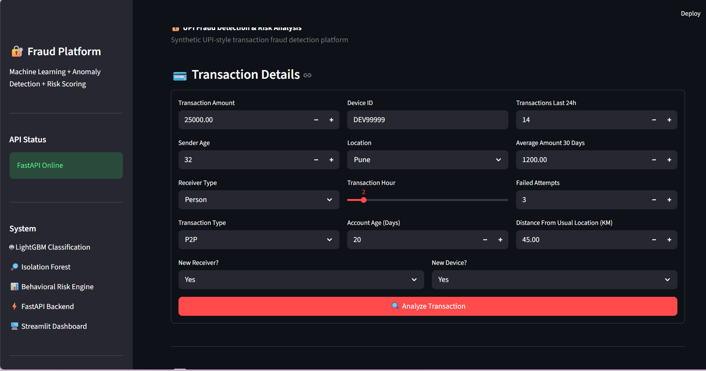
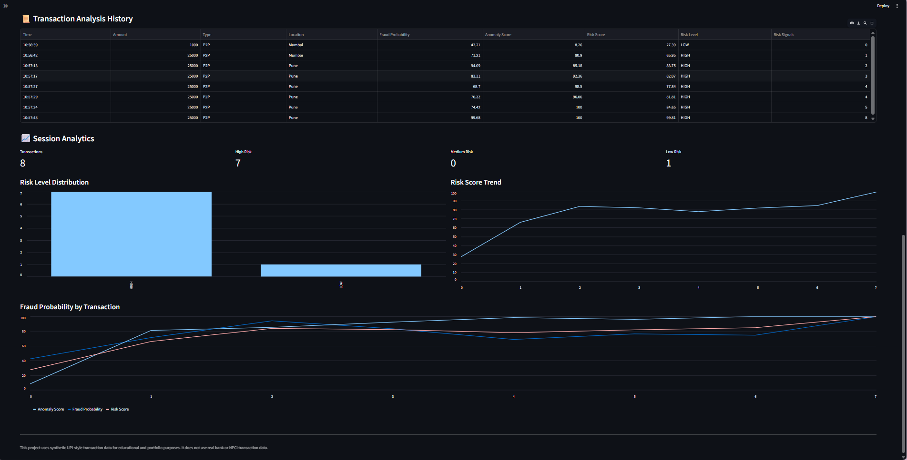
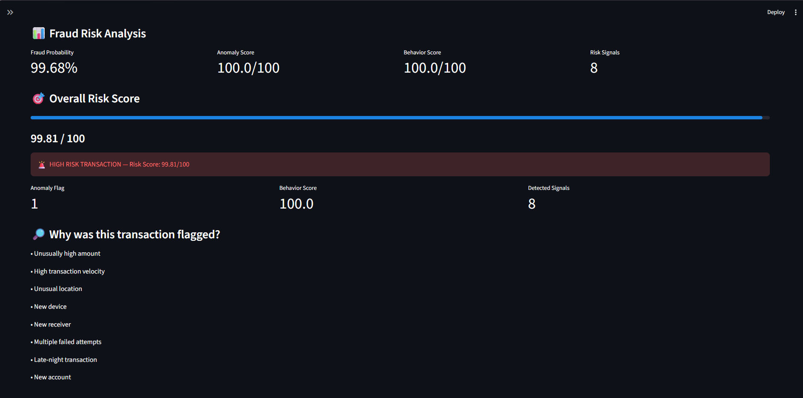

# 🔐 UPI Fraud Detection & Risk Analysis Platform

An end-to-end machine learning project for detecting suspicious patterns in **synthetic UPI-style transactions** using supervised fraud classification, anomaly detection, behavioral risk signals, explainability, a FastAPI backend, and an interactive Streamlit dashboard.

> **Disclaimer:** This project uses synthetic UPI-style transaction data for educational and portfolio purposes. It does not use real bank, customer, or NPCI transaction data.

---

## 📌 Project Overview

Digital payment fraud detection is a highly imbalanced classification problem where fraudulent transactions represent only a small percentage of total transactions.

This project builds an end-to-end fraud analytics pipeline combining:

- Exploratory Data Analysis (EDA)
- Data Cleaning & Preprocessing
- Feature Engineering
- PostgreSQL / SQL Analysis
- Supervised Machine Learning
- Isolation Forest Anomaly Detection
- Behavioral Risk Signals
- Composite Risk Scoring
- SHAP Explainability
- FastAPI Prediction API
- Streamlit Interactive Dashboard
- Docker configuration

The dataset contains **100,000 synthetic UPI-style transactions**, with approximately **2.43% transactions labeled as fraud**.

---

## 🏗️ System Architecture

```text
Synthetic UPI-style Transaction Dataset
                │
                ▼
        Data Cleaning & EDA
                │
                ▼
        Feature Engineering
                │
        ┌───────┴────────┐
        ▼                ▼
 PostgreSQL / SQL   ML Preprocessing
                         │
              ┌──────────┴──────────┐
              ▼                     ▼
     LightGBM Classifier     Isolation Forest
              │                     │
              └──────────┬──────────┘
                         ▼
              Behavioral Risk Engine
                         │
                         ▼
                 Composite Risk Score
                         │
                         ▼
                 SHAP Explainability
                         │
                         ▼
                    FastAPI API
                         │
                         ▼
               Streamlit Dashboard
```

---

## 📊 Dataset

The synthetic dataset contains **100,000 transactions** with features representing transaction, account, device, receiver, and behavioral information.

Example features include:

- Transaction amount
- Transaction hour
- Sender age
- Receiver type
- Transaction type
- Device ID
- Location
- Account age
- Transactions in the last 24 hours
- Average transaction amount over 30 days
- New receiver indicator
- New device indicator
- Failed transaction attempts
- Distance from usual location
- Fraud label

### Target Distribution

| Class | Transactions | Percentage |
|---|---:|---:|
| Normal | 97,575 | 97.575% |
| Fraud | 2,425 | 2.425% |

The approximately **40:1 class imbalance** makes metrics such as precision, recall, F1-score and PR-AUC particularly important.

---

## 🧹 Data Cleaning

The raw dataset was checked for:

- Missing values
- Duplicate transactions
- Duplicate transaction IDs
- Data type consistency
- Timestamp conversion
- Categorical values
- Numerical distributions

The raw dataset contained **1,500 missing cells** across selected features. Missing values were handled during preprocessing, resulting in a cleaned dataset with no remaining missing values.

---

## ⚙️ Feature Engineering

Behavioral and transaction-risk features were created to capture suspicious activity.

### Engineered Features

**Amount-to-Average Ratio**

```text
amount_to_avg_ratio = transaction_amount / average_30_day_amount
```

**High Amount Flag**

Triggered when a transaction is at least 3× the user's recent average.

**Transaction Velocity**

Identifies unusually high transaction activity within 24 hours.

**Location Anomaly**

Flags transactions occurring far from the usual location.

**Device Risk**

Combines a new device with failed transaction attempts.

**Receiver Risk**

Identifies suspicious payments to new receivers involving unusually high amounts.

Additional signals include:

- Multiple failed attempts
- Late-night transaction
- New account
- New device
- New receiver

These signals are combined into a:

```text
risk_signal_count
```

Fraud rate increased as the number of suspicious behavioral signals increased, supporting their use in the risk engine.

---

## 🗄️ PostgreSQL & SQL Analysis

The cleaned and engineered transaction data was also analyzed using PostgreSQL.

SQL analysis included:

- Total transaction counts
- Fraud distribution
- Overall fraud rate
- Fraud by transaction type
- Fraud by location
- Fraud by transaction hour
- New-device risk
- Failed-attempt analysis
- High-value transaction analysis
- Risk-signal analysis
- Suspicious transaction extraction

This provides a traditional analytics layer alongside the machine-learning pipeline.

---

## 🤖 Machine Learning Models

Four supervised classification models were evaluated:

1. Logistic Regression
2. Random Forest
3. XGBoost
4. LightGBM

The dataset was split using a stratified **80/20 train-test split** to preserve the fraud ratio.

### Model Comparison

| Model | Precision | Recall | F1 | PR-AUC | ROC-AUC |
|---|---:|---:|---:|---:|---:|
| Logistic Regression | 0.0436 | 0.2845 | 0.0756 | 0.0575 | 0.5718 |
| Random Forest | 1.0000 | 0.1237 | 0.2202 | 0.1898 | 0.5633 |
| XGBoost | 0.1222 | 0.1773 | 0.1447 | 0.1938 | 0.5836 |
| **LightGBM** | **0.0629** | **0.2412** | **0.0998** | **0.1954** | **0.6000** |

### Final Supervised Model

**LightGBM** was selected as the supervised ranking model because it achieved the strongest overall **PR-AUC and ROC-AUC** among the evaluated models.

Because fraud prevalence is only approximately **2.43%**, the achieved PR-AUC of **0.1954** is substantially above the random baseline associated with the positive-class prevalence.

The results also demonstrate the difficulty of detecting fraud in highly imbalanced data rather than suggesting production-level predictive performance.

---

## 🎚️ Threshold Optimization

The default classification threshold of `0.50` is not always optimal for imbalanced fraud detection.

Threshold analysis was therefore performed across fraud probabilities.

The best observed F1 threshold was approximately:

```text
0.8109
```

At this threshold:

| Metric | Result |
|---|---:|
| Precision | 0.8387 |
| Recall | 0.1608 |
| F1 Score | 0.2699 |
| False Positive Rate | 0.0008 |

The optimal operating threshold in a real fraud system would depend on the business cost of false positives versus missed fraud.

---

## 🔍 Anomaly Detection

Supervised fraud detection is complemented by an **Isolation Forest** model.

The anomaly model analyzes behavioral features such as:

- Transaction amount
- Transaction velocity
- Average historical amount
- Failed attempts
- Distance from usual location
- Amount-to-average ratio
- Risk signal count

The Isolation Forest produces an anomaly score that is normalized to a **0–100 scale**.

This allows the platform to identify unusual transactions even when their behavior is not fully represented by the supervised fraud classifier.

---

## 🎯 Behavioral Risk Engine

Eight behavioral risk signals are evaluated:

1. Unusually high amount
2. High transaction velocity
3. Unusual location
4. New device
5. New receiver
6. Multiple failed attempts
7. Late-night transaction
8. New account

A behavioral score is generated from these signals.

---

## 🧮 Composite Risk Score

The final risk score combines three components:

```text
Risk Score =
0.60 × Fraud Probability
+ 0.25 × Anomaly Score
+ 0.15 × Behavioral Score
```

Transactions are categorized as:

| Risk Score | Risk Level |
|---:|---|
| < 30 | 🟢 LOW |
| 30 – < 60 | 🟡 MEDIUM |
| ≥ 60 | 🔴 HIGH |

The `60/25/15` weighting is an initial heuristic design for this portfolio system and is not presented as a statistically calibrated production risk model.

---

## 🧠 SHAP Explainability

SHAP analysis was used to understand the contribution of model features to individual fraud predictions.

For an analyzed high-risk transaction, major positive SHAP drivers included:

| Feature | SHAP Contribution |
|---|---:|
| Failed Attempts | +1.8506 |
| Device Risk | +1.4569 |
| Amount | +1.4415 |
| New Receiver | +0.4222 |
| Receiver Risk | +0.4018 |
| Risk Signal Count | +0.2158 |
| New Device | +0.1232 |

This helps make model predictions more interpretable and connects machine-learning output with understandable fraud-risk indicators.

---

## ⚡ FastAPI Backend

A FastAPI backend exposes the fraud detection pipeline through REST endpoints.

### Health Check

```http
GET /health
```

### Fraud Prediction

```http
POST /predict
```

The prediction endpoint returns information including:

- Fraud probability
- Anomaly score
- Anomaly flag
- Behavioral score
- Number of detected risk signals
- Overall risk score
- Risk level
- Human-readable risk reasons

Interactive API documentation is available locally through FastAPI Swagger UI.

---

## 🖥️ Streamlit Dashboard

The Streamlit dashboard provides an interactive interface for analyzing transactions.

### Transaction Input



Users can enter transaction, account, device, location, receiver, and behavioral information while monitoring the FastAPI backend status.

### Fraud Risk Analysis



The dashboard displays:

- Fraud probability
- Anomaly score
- Behavioral score
- Risk signal count
- Overall risk score
- LOW / MEDIUM / HIGH classification
- Human-readable reasons for flagged transactions

### Risk Analytics



Session-level analytics include:

- Transaction analysis history
- High/Medium/Low risk counts
- Risk-level distribution
- Risk-score trend
- Fraud probability and anomaly-score trends

---

## 🚨 Example High-Risk Transaction

A deliberately suspicious test transaction containing multiple behavioral signals produced:

```text
Fraud Probability : 99.68%
Anomaly Score      : 100 / 100
Behavior Score     : 100 / 100
Risk Signals       : 8
Overall Risk Score : 99.81 / 100
Risk Level         : HIGH
```

Detected signals:

```text
Unusually high amount
High transaction velocity
Unusual location
New device
New receiver
Multiple failed attempts
Late-night transaction
New account
```

This example demonstrates how the classifier, anomaly detector, and behavioral rules are combined by the application. It should not be interpreted as an estimate of real-world fraud-detection accuracy.

---

## 📁 Project Structure

```text
upi/
│
├── app.py
├── dashboard.py
├── requirements.txt
├── Dockerfile
├── .dockerignore
├── .gitignore
│
├── lightgbm_fraud_model.pkl
├── isolation_forest_model.pkl
├── anomaly_scaler.pkl
├── anomaly_score_scaler.pkl
│
├── data/
│   └── upi_fraud_transactions_100k.csv
│
├── notebooks/
│   ├── 01_data_understanding_eda.ipynb
│   └── 03_machine_learning.ipynb
│
└── screenshots/
    ├── transaction_input.png
    ├── fraud_detection_result.png
    └── risk_analytics.png
```

Generated cleaned, feature-engineered and risk-scored datasets are excluded from Git tracking through `.gitignore`.

---

## 🛠️ Technologies Used

**Programming & Data**

- Python
- Pandas
- NumPy

**Machine Learning**

- Scikit-learn
- LightGBM
- XGBoost
- Isolation Forest
- SHAP

**Data Analysis**

- Matplotlib
- Seaborn
- PostgreSQL
- SQL

**Application**

- FastAPI
- Pydantic
- Streamlit

**Deployment / Engineering**

- Joblib
- Uvicorn
- Docker
- Git / GitHub

---

## 🚀 Running the Project Locally

### 1. Clone the Repository

```bash
git clone <YOUR-REPOSITORY-URL>
cd upi
```

### 2. Create a Virtual Environment

Windows:

```bash
python -m venv venv
venv\Scripts\activate
```

macOS/Linux:

```bash
python3 -m venv venv
source venv/bin/activate
```

### 3. Install Dependencies

```bash
pip install -r requirements.txt
```

### 4. Start FastAPI

```bash
uvicorn app:app --reload
```

FastAPI runs locally at:

```text
http://127.0.0.1:8000
```

Swagger documentation:

```text
http://127.0.0.1:8000/docs
```

### 5. Start Streamlit

Open another terminal:

```bash
streamlit run dashboard.py
```

The Streamlit application will normally open at:

```text
http://localhost:8501
```

Both FastAPI and Streamlit should be running for the complete local application experience.

---

## 🐳 Docker

A Dockerfile is included for containerizing the FastAPI backend.

```bash
docker build -t upi-fraud-api .
docker run -p 8000:8000 upi-fraud-api
```

> Docker configuration is included in the repository. Local non-Docker execution is the currently verified application workflow.

---

## ⚠️ Limitations

This project has several important limitations:

- The dataset is synthetic and does not represent real banking traffic.
- Fraud behavior in real payment systems is significantly more complex.
- Model performance is modest and should not be interpreted as production-level fraud detection.
- The composite risk-score weights are heuristic rather than statistically calibrated.
- `device_id` is a high-cardinality feature and one-hot encoding it increases feature dimensionality.
- Real fraud systems require temporal validation, concept-drift monitoring, calibrated probabilities, security controls and continuous retraining.
- The application is designed as a portfolio and educational system rather than a banking production service.

---

## 🔮 Future Improvements

Potential improvements include:

- Time-based model validation
- Probability calibration
- Cost-sensitive threshold optimization
- High-cardinality feature encoding improvements
- Model monitoring and drift detection
- PostgreSQL-backed prediction history
- Docker Compose for FastAPI + Streamlit
- Cloud deployment
- Authentication and API security
- Automated retraining pipeline

---

## 🎯 Key Learning Outcomes

This project demonstrates an end-to-end data science workflow covering:

```text
Raw Data
   ↓
EDA & Statistical Analysis
   ↓
Data Cleaning
   ↓
Feature Engineering
   ↓
SQL Analytics
   ↓
Machine Learning
   ↓
Anomaly Detection
   ↓
Risk Scoring
   ↓
Explainability
   ↓
REST API
   ↓
Interactive Dashboard
```

It demonstrates how multiple analytical approaches can be combined into a single fraud-risk analysis application rather than treating model training as an isolated task.

---

## 👤 Author

**Ganesh Gokhale**

B.E. Computer Science & Engineering  
Aspiring Data Analyst / Data Scientist

---

## 🌐 Live Demo

🚀 **Try the deployed application:**  
https://upi-fraud-risk-analysis.streamlit.app/

The Streamlit dashboard communicates with a FastAPI backend deployed on Render to generate fraud probabilities, anomaly scores, behavioral risk signals, and an overall transaction risk score.

> The backend uses a free cloud instance, so the first request after inactivity may take a short time while the service wakes up.

⭐ If you found this project useful, consider starring the repository.